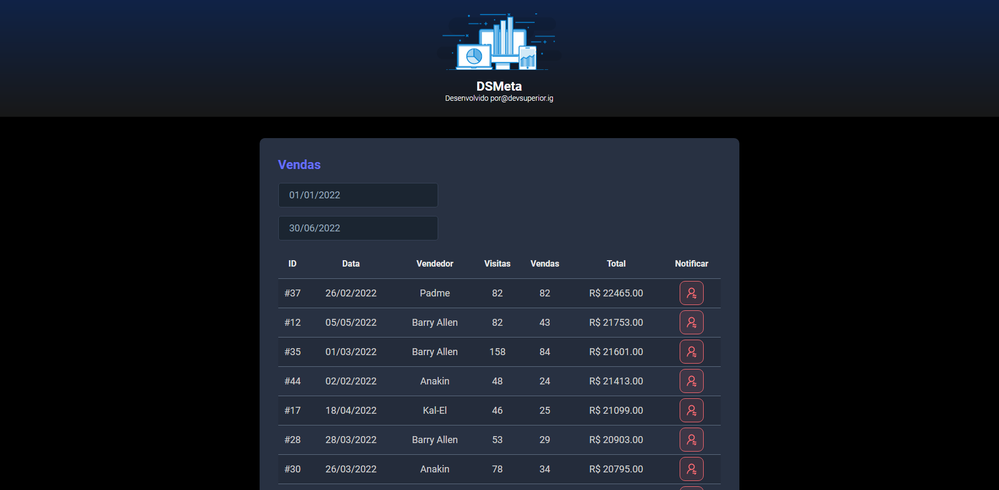

# DSMETA

## Projeto Full Stack da Semana Spring + ReactJS

Este projeto foi desenvolvido no treinamento gratuito de Spring + ReactJS fornecido pela [DevSuperior](http://www.devsuperior.com.br) no período de 14/11/2022 à 20/11/2022. Para informações adicionais, acesse o [Git official do evento](https://github.com/devsuperior/sds-dsmeta)

| Projeto                     | DevSuperior - DSMeta         |
| --------------------------- | ---------------------------- |
| **Nome do Projeto**         | DSMeta (devsuperior-dsmeta)  |
| **Tecnologias**             |   |
| **Link no GitHub**          | https://github.com/Bambatera/devsuperior-dsmeta |
| **Situação**                | Disponível Online            |
| **URL de Acesso**           | https://dsmeta-bambatera.netlify.app |
| **Versão Atual**            | 0.0.1                        |
| **Front-end**                | [React](./frontend/)        |
| **Back-end**                | [Java](./backend/)           |

## Ferramentas utilizadas

* Nodejs 16 e Yarn
* NetBeans 15 (com a extensão)
	* NB SpringBoot
* VS Code (com as estensões)
    * IntelliCode
    * ESLint
    * JSX HTML
* Twilio (SMS)
* Axion (Acesso facilitado ao backend)
* Postman (Teste de API REST)

## Design

Um exemplo do design foi criado no Figma e está disponível nos links:

https://www.figma.com/file/PehiT8Dw4Lv5ioTSULZeRI/DSMeta3

https://www.figma.com/file/Yu2RHFmirHQ4BIVZM2XxY6/DSMeta2

https://www.figma.com/file/EN1zFtk4eY3Jgmpgi9YaMG/DSMeta1

O projeto de preparação da aula pode ser encontrado [aqui](https://github.com/acenelio/dsmeta-css).

## Front-end

O projeto de front-end foi criado com o `Yarn` e está na pasta [frontend](./frontend/). Leia o README do projeto [aqui](./frontend/README.md).

### Hospedagem

O frontend está no [Netlify](www.netlify.com).

## Back-end

O projeto de back-end foi criado com o [Spring Initializr](https://start.spring.io/) e está na pasta [backend](./backend/). Leia o README do projeto [aqui](./backend/README.md).

### Hospedagem

O backend está no [Heroku](www.heroku.com).
